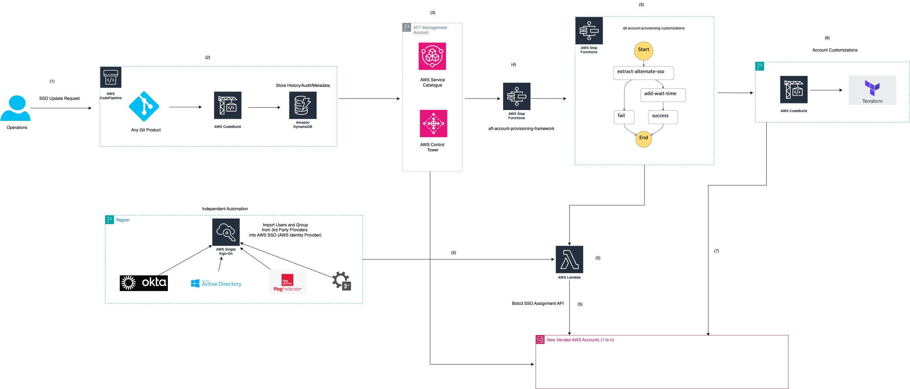

##  Govern SSO Assignments for AWS Accounts using Account Factory for Terraform (AFT)

This solution will introduce a solution that seamlessly integrates AWS Control Tower Account Factory Terraform (AFT) with Single Sign-On (SSO), enhancing large-scale account onboarding process. This innovative approach utilizes custom Lambda code to automate SSO permission set assignments, streamlining the process without requiring manual intervention from the Platform Engineering team. Spee in operation, security, and consistency are just a few advantages of this solution.


## AFT (Account Factory for Terraform)  Overview

As per documentation here, AFT sets up a Terraform pipeline that helps you provision and customize your accounts in AWS Control Tower. AFT follows a GitOps model to automate the processes of account provisioning in AWS Control Tower. You'll create an account request Terraform file, commit to repository, which provides the necessary input that triggers the AFT workflow for account provisioning. After account provisioning is complete, AFT can run additional customization steps, automatically.


## Solution Architecture



 This custom solution uses `aft-account-provisioning-customizations` AFT customizations repository to setup the solution which creates AWS Step Functions workflow which in-turn uses an AWS Lambda Function triggered by Amazon DynamoDB Streams workflow to update custom SSO users/groups for the AWS Account, working in conjunction with  AFT (Account Factory for Terraform). Solution workflow is as below -
 
1. The initial request to update SSO users and/or groups assignment can be initiated when a new AWS Account is created (from the `aft-account-request` repository) or post the account is created.

2. Operator initiates custom SSO users and/or groups assignments using AFT repository aft-account-request. This is the repository which propagates user defined information such as  - Account names, Account-level tags, custom SSO users/groups assignments and custom integrations with 3rd party tools like - Jira, ServiceNow etc

3. User pushes Terraform Code with below user-defined SSO assignment parameters to Git repository (for example GitHub, Amazon CodeCommit etc)


Example parameters to provide for custom SSO assignment - One PrincipalID and PermissionSetArn (As per Boto3 documentation [here](https://boto3.amazonaws.com/v1/documentation/api/latest/reference/services/sso-admin/client/create_account_assignment.html)) - 


`InstanceArn` : The ARN of the IAM Identity Center (AWS SSO) instance under which the operation will be executed.

`PermissionSetArn` : The ARN of the permission set that the admin wants to grant the principal access to.

`PrincipalId` : An identifier for an object in IAM Identity Center, such as a user or group. 

```terraform
 custom_fields = {
    "InstanceArn"         = "Your Instance ID (ORG)",
    "PermissionSetArn"    = "Your Permission Set ARN",
    "PrincipalId"         = "Your Principal ID",
  }
```

**NOTE:** 

4. Operators needs to create custom user and/or groups before running this custom solution. For example in above screenshot of code block, The `InstanceArn` value will always be constant but the values of `PermissionSetArn` and `PrincipalId`  can change based on user choice.

Operators can modify the AWS Lambda code to assign multiple custom  Principal’ ID’s and PermissionSetArn’s like example shown currently in the function code -

```terraform
  custom_fields = {
    "InstanceArn"                    = "Your Instance ID (ORG)",
    "AdminAccessPermissionSetArn"    = "Your Admin Privileges Permission Set ARN",
    "AdminAccessPrincipalId"         = "Your Admin Principal ID",
    "ReadOnlyAccessPermissionSetArn" = "Your Read Only Privileges Permission Set ARN",
    "ReadOnlyAccessPrincipalId"      = "Your Read Only Principal ID",
  }
```

**NOTE:** Operators have an option to chose single or multiple assignments based on specific use-cases. Make sure to update AWS Lambda code based to choice used.


5. AWS CodePipeline records the user-defined metadata into AFT `DynamoDB table`, especially `aft-request-audit` . This table has attributes to record user-defined metadata. The attribute ddb_event_name defines type of AFT operation. If the value of the parameter is -

`INSERT`  : Step Function assigns SSO users/groups at the time of new AWS Account creation

`UPDATE`  : Step Function assigns SSO users/groups post AWS Account creation

The attribute `custom_fields` records fields above mentioned like - `InstanceArn, PermissionSetArn and PrincipalId`


6. Amazon DynamoDB streams trigger the AWS Lambda function aft_suspend_account_ou  as soon as data is inserted or updated as per above step.

7. The AWS lambda function `aft_suspend_account_ou` which is setup in AFT management account assumes a cross-account role in the AWS Control Tower account to assign custom SSO users and/or groups. This Lambda function has the logic (in python) to assign SSO users and/or groups by making a `Boto3` SSO API call `create_account_assignment` with above parameters by fetching values from `aft-request-audit` table attributes.

8. Once the AWS Step Function call is successful, the AWS Accounts are assigned custom users and/or groups.

See [CONTRIBUTING](./CCONTRIBUTING.md) for more information.

## License

This library is licensed under the MIT-0 License. See the LICENSE file.
